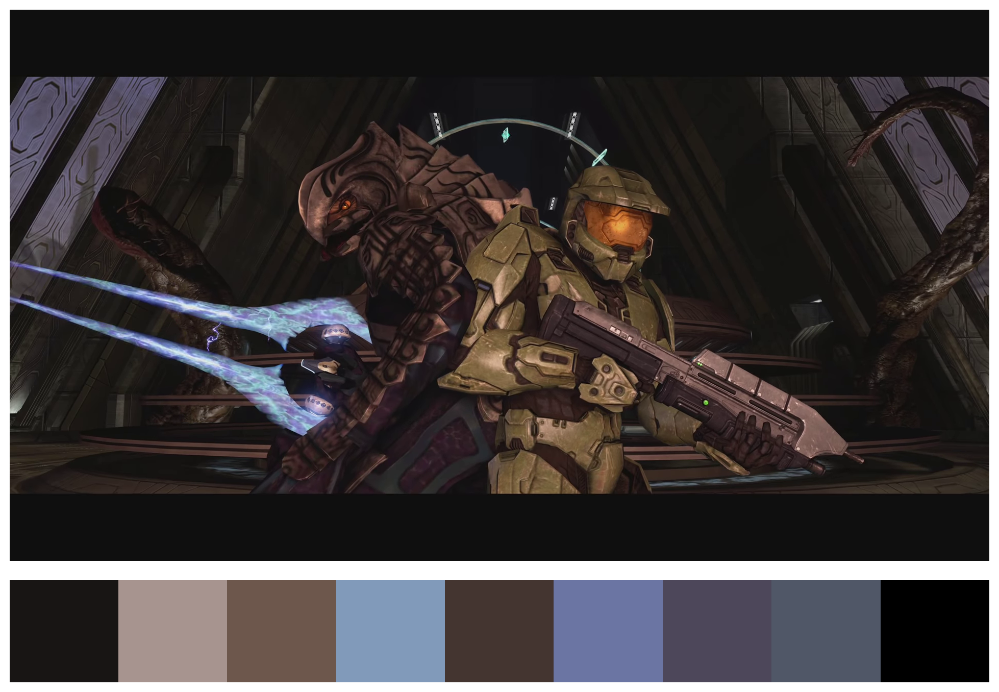

# HaloBot2552

[](https://opensource.org/)
[](https://github.com/sindresorhus/awesome)  

Forreruner artifact in charge of the cinematographic analysis of the data collected during the year 2552 and later years, as well as previous years related to the Human-Covenant battle, or any section related to the Forreruner race.

### Installation

HaloBot requires [Python](https://www.python.org/) to run.

Install the packages.

```sh
$ pip install -r requirements.txt
```

## ¡HAPPY BOT APPRECIATION!

> El silencio llena la tumba vacía ahora que me he ido, 
> pero mi mente no está en calma, las preguntas me acosan. 
> Yo preguntaré y tu responderás...




> New realese doesnt have black/white letterbox
